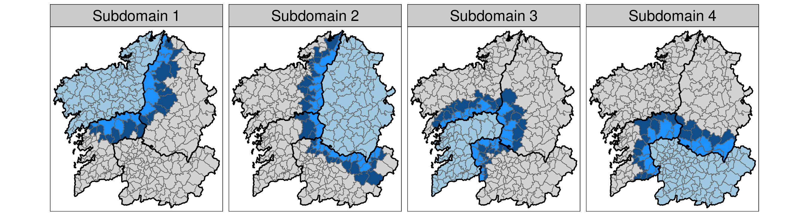
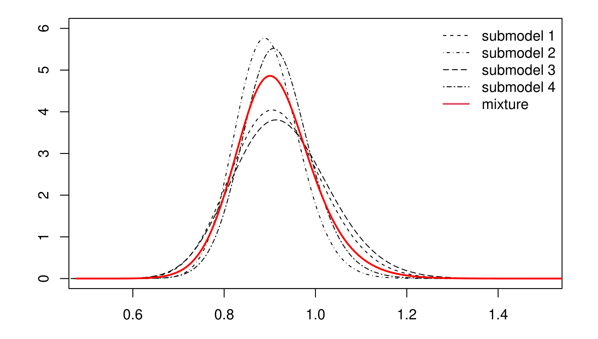

```{r setup, include = FALSE}
knitr::opts_chunk$set(
  collapse = TRUE,
  comment = "#>"
)
```

```{css, echo = FALSE}
.indent {
 margin-left: 40px;
}
```

## Introduction {-#introduction}
In previous vignettes, we show how to [fit spatial Poisson mixed models for high-dimensional areal count data](https://emi-sstcdapp.unavarra.es/bigDM/bigDM-1-fitting-spatial-models.html)  and how to use  [parallel or distributed computation strategies](https://emi-sstcdapp.unavarra.es/bigDM/bigDM-2-parallel-and-distributed-modelling.html) using the __bigDM__ package. Here, we describe how to use this package to fit spatio-temporal models with conditional autoregressive (CAR) priors for space and random walk (RW) priors for time including space-time interactions [@held2000bayesian;@ugarte2014fitting] by extending the scalable model's proposals described in @orozco2020 to deal with massive spatio-temporal data [@orozco2022].

## Spatio-temporal models in disease mapping {-#spatio-temporal-models-in-disease-mapping}
Let us assume that the region under study is divided into $n$ contiguous small areas labeled as $i=1,\ldots,n$ and data are available for consecutive time periods labeled as $t=1,\ldots,T$. For a given area $i$ and time period $t$, 

* $O_{it}$ denotes the number of observed cases for area $i$ and time $t$
* $E_{it}$ denotes the number of expected cases for area $i$ and time $t$
* $r_{it}$ is the relative risk of mortality (incidence)

To compute the number of expected cases $E_{it}$, both direct and indirect standardization procedures can be performed [@ugarte2009], usually considering age and/or sex as standardization variables. Using the indirect standardization method, the number of expected cases for area $i$ and time $t$ is defined as

$$E_{it}=\sum_{j=1}^{J}N_{it}\frac{O_j}{N_j} \ \ \mbox{for} \  \ i=1,\ldots,n; \ \ t=1,\ldots,T,$$
where $O_j=\sum_{i=1}^{n}\sum_{t=1}^{T}O_{itj}$ and $N_j=\sum_{i=1}^{n}\sum_{t=1}^{T}N_{itj}$ are the number of observed cases and the population at risk in the $j^{th}$ age-group, respectively. Then, the standardized mortality/incidence ratio (SMR or SIR) is defined as the number of observed cases divided by the number of expected cases. Although its interpretation is very simple, these measures are extremely variable when analyzing rare diseases or very low-populated areas, as it is the case of high-dimensional data. This makes it necessary the use of statistical models to smooth risks borrowing information from neighbouring regions and time periods.

Poisson mixed models are typically used for the analysis of count data within a hierarchical Bayesian framework. Conditional to the relative risk $r_{it}$, the number of observed cases in the $i$th area and time period $t$ is assumed to be Poisson distributed with mean $\mu_{it} = E_{it}r_{it}$. That is,

\begin{eqnarray*}
\label{eq:Model_Poisson}
\begin{array}{rcl}
O_{it}|r_{it} & \sim & Poisson(\mu_{it}=E_{it}r_{it}),\\
\log \mu_{it} & = & \log E_{it}+\log r_{it},
\end{array}
\end{eqnarray*}

where $\log E_{it}$ is an offset. Depending on the specification of the log-risks different models can be defined. The non-parametric models based on CAR priors for spatial random effects, random walk priors for temporal random effects, and different types of spatio-temporal interactions described in @held2000bayesian are currently implemented in the __bigDM__ package.

So, the log-risks are modelled as

\begin{equation}
\label{eq:logrisk}
\log r_{it}=\alpha+\xi_{i}+\gamma_t+\delta_{it},
(\#eq:global)
 \end{equation}
 
where:

* $\alpha$ is a global intercept
* $\xi_i$ is a spatial random effect with CAR prior distribution.
* $\gamma_t$ is a temporally structured random effect that follows  random walk prior distribution
* $\delta_{it}$ is a spatio-temporal random effect (four types of interactions)

In what follows, we will refer to model \@ref(eq:global) as the __Global model__. These models are flexible enough to describe many real situations, and their interpretation is simple and attractive. However, the models are typically not identifiable and appropriate sum-to-zero constraints must be imposed over the random effects [@goicoa2018spatio]. See Table \@ref(tab:Constraints) for a full description of the identifiability constraints that needs to be imposed in each type of space-time interaction. 


### Prior distributions for the random effects {-#prior-distributions}
Several priors distributions for spatial and temporal random effect are implemented in the `STCAR_INLA()` function, which are specified through the `spatial=...` and `temporal=...` arguments.

For the spatial random effect, the same values as the `prior=...` argument in the `CAR_INLA()`function are defined (see the vignette [bigDM: fitting spatial models](https://emi-sstcdapp.unavarra.es/bigDM/bigDM-1-fitting-spatial-models.html) for more details). For the temporally structured random effect, random walks of first (RW1) or second order (RW2) prior distributions can be assumed as follow:

\begin{equation}
\label{eq:temporal}
\gamma \sim N(0,[\tau_{\gamma}R_{\gamma}]^{-}),
\end{equation}

where $\tau_{\gamma}$ is a precision parameter and $R_{\gamma}$ is the $T \times T$ structure matrix of a RW1/RW2 (see @rue2005gaussian, pp. 95 and 110) and $^{-}$ denotes the Moore-Penrose generalized inverse. Finally, the following prior distribution is assumed for the space-time interaction random effect $\delta=(\delta_{11},\ldots,\delta_{n1},\ldots,\delta_{1T},\ldots,\delta_{nT})^{'}$

\begin{equation}
\label{eq:space-time}
\delta \sim N(0,[\tau_{\delta}R_{\delta}]^{-}).
\end{equation}

Here, $\tau_{\delta}$ is a precision parameter and $R_{\delta}$ is the $nT \times nT$ matrix obtained as the Kronecker product of the corresponding spatial and temporal structure matrices (recall that $R_{\xi}=\textbf{D}_{W}-\textbf{W}$), where four types of interactions can be considered (see Table \@ref(tab:Interactions)).


| Interaction |      $R_{\delta}$     | Spatial correlation | Temporal correlation |
|-------------|:---------------------:|:-------------------:|:--------------------:|
| Type I      | $I_{T} \otimes I_{n}$ |          -          |           -          |
| Type II     | $R_{\gamma} \otimes I_{n}$ |          -          |     $\checkmark$     |
| Type III    | $I_{T} \otimes R_{\xi}$ |     $\checkmark$    |           -          |
| Type IV     | $R_{\gamma} \otimes R_{\xi}$ |     $\checkmark$    |     $\checkmark$     |
Table: (\#tab:Interactions) Specification for the different types of space-time interactions


| Interaction |      $R_{\delta}$     | Constraints |
|-------------|:---------------------:|:-------------------:|
| Type I      | $I_{T} \otimes I_{n}$ |$\sum\limits_{i=1}^n \xi_i=0, \, \sum\limits_{t=1}^T \gamma_t=0, \, \mbox{ and } \, \sum\limits_{i=1}^n \sum\limits_{t=1}^T \delta_{it}=0.$ |
| Type II     | $R_{\gamma} \otimes I_{n}$ |$\sum\limits_{i=1}^n \xi_i=0, \, \sum\limits_{t=1}^T \gamma_t=0, \, \mbox{ and } \, \sum\limits_{t=1}^T \delta_{it}=0, \, \mbox{for } \, i=1,\ldots,n.$|
| Type III    | $I_{T} \otimes R_{\xi}$ |     $\sum\limits_{i=1}^n \xi_i=0, \, \sum\limits_{t=1}^T \gamma_t=0, \, \mbox{ and } \, \sum\limits_{i=1}^n \delta_{it}=0, \, \mbox{for } \, t=1,\ldots,T.$ |
| Type IV     | $R_{\gamma} \otimes R_{\xi}$ |     $\sum\limits_{i=1}^n \xi_i=0, \, \sum\limits_{t=1}^T \gamma_t=0, \,  \mbox{ and } \,
\begin{array}{l} \sum\limits_{t=1}^T \delta_{it}=0, \, \mbox{for } \, i=1,\ldots,n, \\ \sum\limits_{i=1}^n \delta_{it}=0, \, \mbox{for } \, t=1,\ldots,T. \\ \end{array}$    |
Table: (\#tab:Constraints) Identifiability constraints for the different types of space-time interaction effects in CAR models


### Prior distributions for the hyperparameters {-#hyperprior-distributions}

In all the models for latent Gaussian fields described in this vignette, prior distributions for the precision parameters have to be specified. By default, log-Gamma distributions are given to
the log-precision parameters in `R-INLA`. However, these priors may lead to wrong results and
have been criticized in the literature [@simpson2017penalising;@carroll2015comparing]. 

Here, improper uniform prior distribution on the positive real line are considered for the standard deviations, i.e., $\sigma=1/\sqrt{\tau} \sim U(0,\infty)$ and standard uniform distribution for the spatial smoothing parameter, i.e., $\beta \sim U(0,1)\equiv \mbox{Beta}(1,1)$ when fitting the LCAR or BYM2 model for the spatial random effect. Penalised complexity (PC) priors [@simpson2017penalising] are also available in `STCAR_INLA()`function by setting the argument `PCpriors=TRUE`. If PC priors are used for the precision of a Gaussian random effect, the parameters $U$ and $\alpha$ must be specified so that $P(\sigma>U)=\alpha$. The default values in `R-INLA` $(U,\alpha)=(1,0.01)$ are considered when fitting the iCAR and RW1/RW2 prior distributions, as well as for the corresponding space–time interaction effect. If the BYM2 model is selected for the spatial random effect $\xi$, the values $(U,\alpha)=(0.5,0.5)$ are given to the probability statement $P(\lambda_{\xi}>U)=\alpha$.


## The `STCAR_INLA` function {-#STCAR_INLA-function}
As in the `CAR_INLA()` function, three main modelling approaches can be considered:

* the usual model with a global spatial random effect whose dependence structure is based on the whole neighbourhood graph of the areal units (`model="global"` argument),
* a disjoint model based on a partition of the whole spatial domain where independent spatial
CAR models are simultaneously fitted in each partition (`model="partition"` and `k=0` arguments),
* a modelling approach where $k$-order neighbours are added to each partition to avoid border effects in the disjoint model (`model="partition"` and `k>0` arguments).

For both the disjoint and $k$-order neighbour models, parallel or distributed computation strategies can be performed to speed up computations by using the __future__ package [@bengtsson2020unifying]. See the vignette [bigDM: parallel and distributed modelling](https://emi-sstcdapp.unavarra.es/bigDM/bigDM-2-parallel-and-distributed-modelling.html) for some examples and further details.

Both the data of analysis and its associated cartography file needs specified into the `STCAR_INLA()` function. These are some of the most relevant arguments of this function:

* `carto`: an object of class `sf` or `SpatialPolygonsDataFrame` that must contain at least the target variable of interest specified in the argument `ID.area`.
* `data`: an object of class `data.frame` which must contain the target variables of interest specified in the arguments `ID.area`, `ID.year`, `O` and `E`.
* `ID.area`: name of the variable which contains the IDs of spatial areal units. The values of this variable must match those given in the carto and data variable.
* `ID.year`: name of the variable which contains the IDs of time points.
* `ID.group`: name of the variable which contains the IDs of the spatial partition (grouping variable). Only required if `model="partition"`.
* `O`: name of the variable which contains the observed number of disease cases for each areal and time point.
* `E`: name of the variable which contains either the expected number of disease cases or the population at risk for each areal unit and time point.
* `W`: optional argument with the binary adjacency matrix of the spatial areal units. If `NULL` (default), this object is computed from the `carto` argument (two areas are considered as neighbours if they share a common border).

The `Carto_SpainMUN` object included in the __bigDM__ package, contains the spatial polygons of the municipalities of continental Spain and simulated colorectal cancer mortality data (see the [examples of the CAR_INLA function](https://emi-sstcdapp.unavarra.es/bigDM/bigDM-1-fitting-spatial-models.html#Initial_step:_input_argument_for_the_CAR_INLA_function)).

```{r message=FALSE}
library(bigDM)

data("Carto_SpainMUN")
head(Carto_SpainMUN)
```

In this vignette, simulated data of lung cancer mortality data during the period 1991-2015 included in the object `Data_LungCancer` will be used as illustration (modified in order to preserve the confidentiality of the original data).

```{r message=FALSE}
data("Data_LungCancer")
head(Data_LungCancer)
```

Note that both objects contains a common identification variable of the areal units named as `ID`.


### Global model {-#global-model}

We refer as _Global model_ to spatio-temporal model described in Equation \@ref(eq:global),  where the whole neighbourhood graph of the areal units is considered to define the adjacency matrix $\textbf{W}$.

The Global model with a BYM2 spatial random effect, RW1 temporal random effect and Type IV interaction random effect (default values) is fitted using the `STCAR_INLA()` function as

```{r, eval=FALSE}
# Not run:
Global <- STCAR_INLA(carto=Carto_SpainMUN, data=Data_LungCancer,
                     ID.area="ID", ID.year="year", O="obs", E="exp",
                     spatial="BYM2", temporal="rw1", interaction="TypeIV",
                     model="global", strategy="gaussian")
```

When the number of small areas and time periods increases considerably (as is the case of analysing count data at municipality level), fitting the Global model becomes computationally very demanding or even unfeasible. Instead of considering global random effects whose correlation structures are based on the whole spatial/temporal neighbourhood graphs of the areal-time units, we propose to divide the data into $D=D_{s}\times D_{t}$ sub-domains, where $D_{s}$ and $D_{t}$ are the number spatial and temporal partitions, respectively. Doing so, local spatio-temporal models can be fitted simultaneously (in parallel or distributed) substantially reducing the computational time. In what follows, we show how to fit the __Disjoint__ and __k-order neighbourhood models__ (extending the methodology described in @orozco2020) for estimating spatio-temporal disease risks using the `STCAR_INLA()` function.


### Disjoint model {-#Disjoint-model}

Note that in the Disjoint model each area-time unit area-time unit belongs to a single sub-domain. Consequently, the log-risk surface $\log{\boldsymbol{r}} = (\log{\boldsymbol{r}_1},\ldots,\log{\boldsymbol{r}_{D}})^{'}$ is just the union of the posterior marginal estimates of each spatio-temporal sub-model.

For our example data in `Data_LungCancer` we propose to divide the data into the $D_s=47$ provinces of continental Spain (no temporary partition is defined as only 25 time periods are being considered). To classify the areas into provinces, the first two digits of the `ID.area` variable is used.

```{r}
Carto_SpainMUN$ID.prov <- substr(Carto_SpainMUN$ID,1,2)
```

In the code below, we show how to fit the Disjoint model with Type I space-time interaction random effect and Gaussian approximation strategy using 4 local clusters (in parallel)

```{r, warning=FALSE}
Disjoint <- STCAR_INLA(carto=Carto_SpainMUN, data=Data_LungCancer,
                       ID.area="ID", ID.year="year", O="obs", E="exp", ID.group="ID.prov", 
                       spatial="BYM2", temporal="rw1", interaction="TypeI",
                       model="partition", k=0, strategy="gaussian",
                       plan="cluster", workers=rep("localhost",4))

summary(Disjoint)
```
<font size="1"> _\* Computations are made in personal computer with a 3.41 GHz Intel Core i5-7500 processor and 32GB RAM using R-INLA stable version INLA_21.11.22._</font> 


### k-order neighbourhood model {-#k-order-neighbourhood-model}

Assuming independence between areas belonging to different sub-domains could be very restrictive and it may lead to border effects. The __k-order neighbourhood model__ avoids this undesirable issue by adding neighbouring areas to each partition of the spatial domain.

\
```{r, echo=FALSE, fig.align = 'center', out.width = "110%", fig.cap="Toy example of a spatial partition using the disjoint and 1st/2nd-order neighbourhood models."}

```

\
Since multiple relative risk estimates are obtained for some area-time units, we compute mixture distributions of the posterior probability density functions estimated from the different local spatio-temporal models to obtain a single posterior distribution for each $r_{it}$. 

```{r, echo=FALSE, fig.align = 'center', out.width = "60%", fig.cap="Toy example of a mixture distribution of posterior marginal estimates of relative risks."}

```

\
In the code below, we show how to fit the 1st-order neighbourhood model with Type I space-time interaction random effect and Gaussian approximation strategy using 4 local clusters (in parallel)

```{r, warning=FALSE}
order1 <- STCAR_INLA(carto=Carto_SpainMUN, data=Data_LungCancer,
                       ID.area="ID", ID.year="year", O="obs", E="exp", ID.group="ID.prov", 
                       spatial="BYM2", temporal="rw1", interaction="TypeI",
                       model="partition", k=1, strategy="gaussian",
                       plan="cluster", workers=rep("localhost",4))

summary(order1)
```
<font size="1"> _\* Computations are made in personal computer with a 3.41 GHz Intel Core i5-7500 processor and 32GB RAM using R-INLA stable version INLA_21.11.22._</font> 


### Plot the results {-#plot-the-results}

Once the model is fitted, maps of posterior median estimates of relative risks $r_{it}$ and posterior exceedence probabilities $P(r_{it}>1 | {\bf O})$ can be plotted using the __tmap__ library as

```{r, warning=FALSE}
library(tmap)
library(RColorBrewer)

## Results for 1st-order neighbourhood model ##
Model <- order1

S <- length(unique(Data_LungCancer$ID))
T <- length(unique(Data_LungCancer$year))
t.from <- min(Data_LungCancer$year)
t.to <- max(Data_LungCancer$year)
```


```{r, warning=FALSE, fig.align='center', out.width="100%", fig.cap="Posterior median estimates of relative risks."}

## Maps of posterior median estimates of relative risks ##
risks <- matrix(Model$summary.fitted.values$`0.5quant`, nrow=S, ncol=T, byrow=F)
colnames(risks) <- paste("Year", seq(t.from,t.to), sep=".")

carto <- cbind(Carto_SpainMUN,risks)

paleta <- brewer.pal(8,"RdYlGn")[8:1]
values <- c(-Inf,0.67,0.77,0.83,1,1.20,1.30,1.50,Inf)

Map.risks <- tm_shape(carto) +
  tm_polygons(col= paste("Year",round(seq(t.from,t.to,length.out=9)),sep= "."),
              palette=paleta, title="", legend.show=T, border.col="transparent",
              legend.reverse=T, style="fixed", breaks=values, interval.closure="left") +
  tm_grid(n.x=5, n.y=5, alpha=0.2, labels.format=list(scientific=T),
          labels.inside.frame=F, labels.col="white") +
  tm_layout(main.title="", main.title.position="center", panel.label.size=1.5,
            legend.outside=T, legend.outside.position="right", legend.frame=F, 
            legend.outside.size=0.2, outer.margins=c(0.02,0.01,0.02,0.01),
            panel.labels=as.character(round(seq(t.from,t.to,length.out=9)))) + 
  tm_facets(nrow=3, ncol=3)

print(Map.risks)
```

\
```{r, warning=FALSE, fig.align='center', out.width="100%", fig.cap="Posterior exceedence probabilities."}

## Maps of posterior exceedence probabilities ##
probs <- matrix(1-Model$summary.fitted.values$`1 cdf`, S, T, byrow=F)
colnames(probs) <- paste("Year", seq(t.from,t.to), sep=".")

carto <- cbind(Carto_SpainMUN,probs)

paleta <- brewer.pal(6,"Blues")[-1]
values <- c(0,0.1,0.2,0.8,0.9,1)

Map.probs <- tm_shape(carto) +
  tm_polygons(col=paste("Year",round(seq(t.from,t.to,length.out=9)),sep="."),
              palette=paleta, title="", legend.show=T, border.col="transparent",
              legend.reverse=T, style="fixed", breaks=values, interval.closure="left",
              labels=c("[0-0.1)","[0.1-0.2)","[0.2-0.8)","[0.8-0.9)","[0.9-1]")) +
  tm_grid(n.x=5, n.y=5, alpha=0.2, labels.format=list(scientific=T),
          labels.inside.frame=F, labels.col="white") +
  tm_layout(main.title="", main.title.position="center", panel.label.size=1.5,
            legend.outside=T, legend.outside.position="right", legend.frame=F,
            legend.outside.size=0.2, outer.margins=c(0.02,0.01,0.02,0.01), 
            panel.labels=as.character(round(seq(t.from,t.to,length.out=9)))) + 
  tm_facets(nrow=3, ncol=3)

print(Map.probs)
```


## Acknowledgments {-#acknowledgments}
This research has been supported by the Spanish Ministry of Science and Innovation (projects MTM 2017-82553-R (AEI/FEDER, UE) and PID2020-113125RB-I00 (AEI)). It has also been partially funded by the Public University of Navarra (project PJUPNA20001).


## References